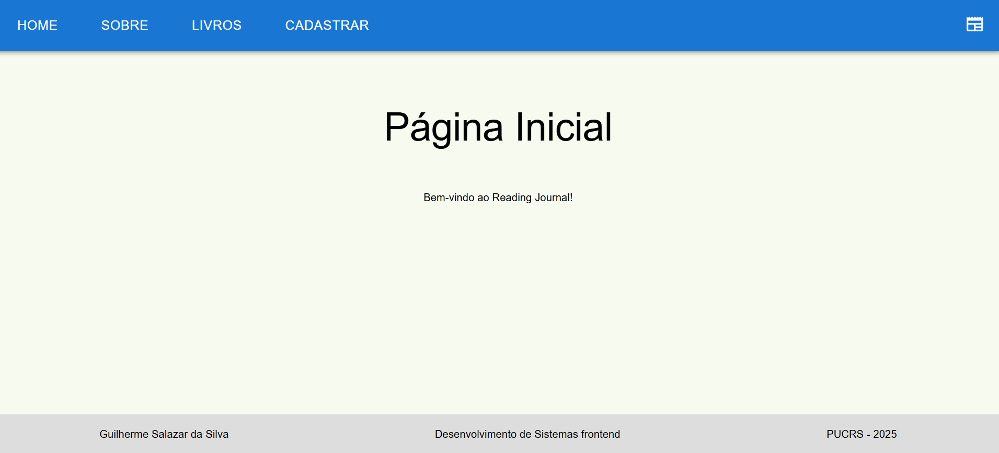

Para executar este projeto:

1. Rode npm install para instalar as dependências do projeto:

```

2. E em seguida, npm start, para iniciar a execução do projeto.

```

Após execução do projeto, este é o resultado esperado no navegador:



## Introdução

Introdução
Este projeto contém Create, Read, Update e Delete de um Reading Journal.

## Componentes

Os componentes estão no diretório `./src/components/pages` e eles possuem as seguintes características:

-   Sobre:

    -   Exibe uma breve descrição a aplicação.

-   Books:

    -   Exibe a lista de livros cadastrados com botões para editar e deletar o registro.

-   Edit:

    -   Exibe a tele inicial do sistemas.

-   Register: - Componente realiza a criação dos registros.
    Componentes
    Os componentes estão no diretório ./src/pages e eles possuem as seguintes características:

## Conclusão

Este projeto é faz parte da disciplina de Desenvolvimento de Sistemas Frontend, tecnlogia utilizada no desenvolvimento foi ReactJS.
